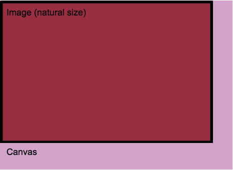
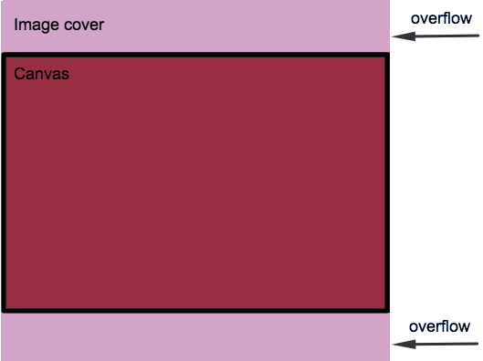

# Canvas image cover position
This method is helpful for calculating image position for fitting canvas element. A behavior is same as css property 'background-size: cover;'



```javascript
canvasImageCoverPosition(
imageNaturalWidth,
imageNaturalHeight,
canvasWidth,
canvasHeight,
[offsetLeft, offsetTop]
)
```
## Installation 
Just add file or function to your project

**or**

```bash
$ npm install @agilie/canvas-image-cover-position
```
## How to use
```javascript
var imagePosition = canvasImageCoverPosition(
image.naturalWidth,
image.NaturalHeight,
canvas.width,
canvas.height,
0.5,
0.5
)
canvas.getContext('2d').drawImage(
image,
imagePosition.offsetLeft,
imagePosition.offsetTop,
imagePosition.width,
imagePosition.height
);
```
<a href="https://agilie.github.io/canvas-image-cover-position/" style="font-size: 20px" target="_blank">demo</a>
## Troubleshooting
Problems? Check the [Issues](https://github.com/agilie/canvas-image-cover-position/issues) block 
to find the solution or create an new issue that we will fix asap. Feel free to contribute.
## Author
This Angular module is open-sourced by [Agilie Team](https://www.agilie.com) <info@agilie.com>
## Contributors
[Bohdan Zolotukhyn](https://github.com/fargo23)
## License
The [MIT](LICENSE) License (MIT) Copyright © 2017 [Agilie Team](https://www.agilie.com)
